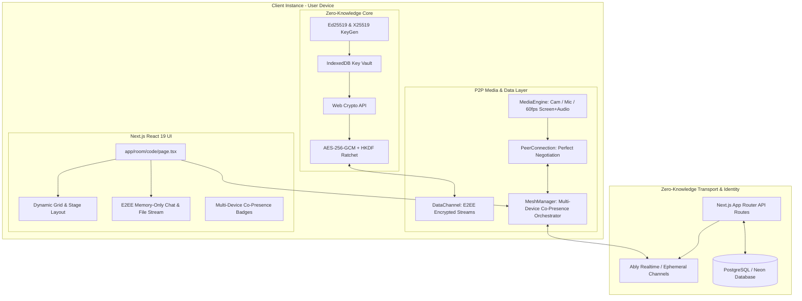

# GhostProtocol (AetherMesh / SilentPeer / CloakRTC)

> **Zero-Knowledge, Multi-Device Co-Presence Real-Time Communication Platform**  
> Built with Next.js (App Router, TypeScript), WebRTC Mesh topology, Web Crypto E2EE (AES-256-GCM + Ed25519/X25519), Ably Realtime Ephemeral Signaling, and Prisma / Neon PostgreSQL.

---

## 1. Core Architecture & Zero-Knowledge Invariants



### Zero-Knowledge Guarantees
- **No Plaintext Stored**: The backend database stores only device metadata and public keys (`publicKeyEd`, `publicKeyDh`).
- **Hardware-Generated Keys**: Every device generates its own asymmetric keypair locally in `IndexedDB` on first launch:
  - **Ed25519**: Digital signatures verifying presence and signal envelopes to prevent MITM attacks.
  - **X25519**: Diffie-Hellman (ECDH) key exchange for deriving symmetric session keys via HKDF-SHA-256.
- **Media Encryption**: Real-time video/audio streams are hardware-encrypted in transit via **DTLS-SRTP**.
- **DataChannel & File Encryption**: Chat and file chunks are encrypted with **AES-256-GCM** using unique 96-bit IVs and verified with SHA-256 integrity digests.
- **Ephemeral Memory Chat**: Chat messages are held in browser memory only and wiped immediately on leave or via the panic button.

---

## 2. Multi-Device Co-Presence

A single authenticated user identity (`userId`) can join the same room across multiple devices simultaneously:
- **Phone / Mobile**: Used for camera and microphone voice audio.
- **Desktop / Laptop**: Used simultaneously for 60fps screen sharing with system audio.
- The `MeshManager` routes each device instance independently using composite `userId:deviceId` identifiers, eliminating session takeover conflicts and displaying sister instance badges (`[Phone - Voice/Cam]`, `[Desktop - 60fps Screen]`).

---

## 3. Directory Structure

```
src/
├── core/
│   ├── crypto/
│   │   ├── keygen.ts         # Ed25519 (signatures) and X25519 (ECDH) key generation & Safety Numbers
│   │   ├── cipher.ts         # AES-256-GCM encryption/decryption, HKDF-SHA256, chunked file hashing
│   │   └── storage.ts        # Secure IndexedDB vault for non-extractable client keys
│   ├── webrtc/
│   │   ├── PeerConnection.ts # RTCPeerConnection wrapper with Perfect Negotiation state machine
│   │   ├── MeshManager.ts    # Full mesh orchestrator with Multi-Device Co-Presence & renegotiation
│   │   ├── MediaEngine.ts    # Studio audio, HD camera, and 60fps screen share with system audio
│   │   └── DataChannel.ts    # E2EE text messages and binary file chunk streaming
│   └── signaling/
│       ├── SignalingClient.ts# Abstract signaling protocol definition & typed envelopes
│       └── AblySignaler.ts   # Ephemeral Pub/Sub signaling implementation over Ably Realtime
├── components/
│   ├── call/                 # VideoGrid, VideoTile, ControlBar, MultiDeviceBadge
│   ├── chat/                 # ChatPanel (memory-only E2EE chat + drag-and-drop file streaming)
│   └── auth/                 # SecurityModal (Safety Numbers) and DeviceSetupModal (Pre-call lobby)
├── hooks/
│   ├── useCrypto.ts          # Key vault lifecycle & fingerprint calculation
│   ├── useMediaDevices.ts    # Mic, camera, screen share, and audio level meters
│   └── useWebRTC.ts          # Unified room mesh connection orchestrator
├── lib/
│   ├── db.ts                 # Global Prisma Client with connection pooling
│   ├── ably.ts               # Ably token authentication helpers
│   └── utils.ts              # Styling & format utilities
└── app/
    ├── api/
    │   ├── auth/device/      # Public key registration & heartbeat
    │   ├── rooms/            # Room creation and code lookup
    │   └── signaling-token/  # Ephemeral Ably token issuer
    ├── room/[code]/page.tsx  # Multi-device co-presence room interface
    ├── page.tsx              # Tactical landing page & fast room entry
    ├── layout.tsx            # Dark tactical viewport layout
    └── globals.css           # Styling & custom scrollbars
```

---

## 4. Setup & Deployment Guide

### Local Development

1. **Clone and Install Dependencies**:
   ```bash
   npm install
   ```

2. **Configure Environment Variables**:
   Copy `.env.example` to `.env.local`:
   ```bash
   cp .env.example .env.local
   ```
   Set your Ably API key:
   ```env
   ABLY_API_KEY="your-ably-api-key"
   POSTGRES_PRISMA_URL="postgresql://..."
   POSTGRES_URL_NON_POOLING="postgresql://..."
   ```

3. **Provision Database**:
   ```bash
   npx prisma generate
   npx prisma db push
   ```

4. **Start Development Server**:
   ```bash
   npm run dev
   ```
   Open [http://localhost:3000](http://localhost:3000).

---

### Deployment on Vercel + Neon Postgres

1. **Push Code to Git Repository** (GitHub / GitLab).
2. **Import Project into Vercel**:
   - Framework preset: `Next.js`
   - Add integration: **Vercel Postgres (Neon Serverless Postgres)**.
3. **Set Environment Variables on Vercel**:
   - `ABLY_API_KEY`: Your Ably API Key.
   - `POSTGRES_PRISMA_URL`: Injected automatically by Vercel Postgres.
   - `POSTGRES_URL_NON_POOLING`: Injected automatically by Vercel Postgres.
   - `NEXT_PUBLIC_APP_URL`: `https://your-domain.vercel.app`
4. **Deploy**:
   Vercel runs `npm run build` and deploys automatically.
